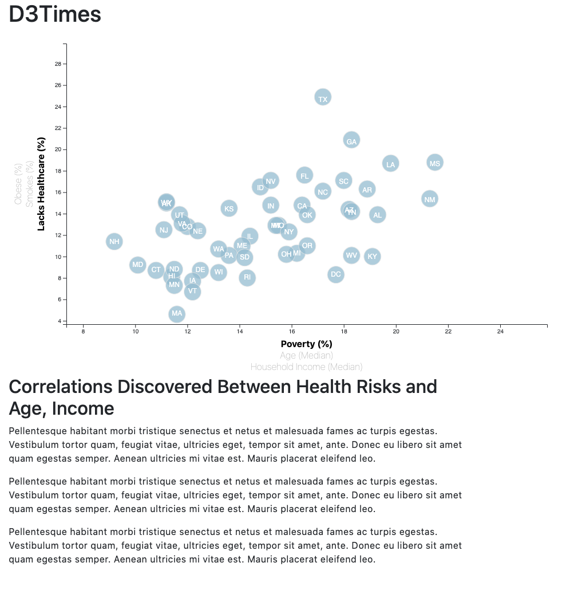

# d3_challenge

## Background

Welcome to the newsroom! You've just accepted a data visualization position for a major metro paper. You're tasked with analyzing the current trends shaping people's lives, as well as creating charts, graphs, and interactive elements to help readers understand your findings.

The editor wants to run a series of feature stories about the health risks facing particular demographics. She's counting on you to sniff out the first story idea by sifting through information from the U.S. Census Bureau and the Behavioral Risk Factor Surveillance System.

The data set included with the assignment is based on 2014 ACS 1-year estimates: [https://factfinder.census.gov/faces/nav/jsf/pages/searchresults.xhtml](https://factfinder.census.gov/faces/nav/jsf/pages/searchresults.xhtml), but you are free to investigate a different data set. The current data set includes data on rates of income, obesity, poverty, etc. by state. MOE stands for "margin of error."

## Core Assignment

* Use d3 to create a scatter graph that shows the relationship between `Poverty`, `Age`, `Household Income` and `Obese`, `Lacks Healthcare`, `Smokes`

* Using d3-tip, format the circles so that the state abreviation is shown on the circle. Also create an event listener so that when cirlces are hovered over, it will display the state and the data for the x and y variable

* Create an event listener so that when a different variable on the x or y axis is clicked, the scatter graph with create a new plot that shows the relationship between the chosen variables. 

## Output

